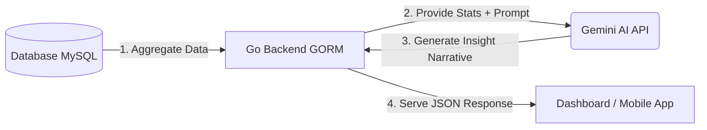

# Teknikal Desain: AI Performance Insights Harmony Laundry

Dokumen ini merinci rancangan teknis untuk mengintegrasikan Gemini AI ke dalam sistem Harmony Laundry guna memberikan insight performa bisnis (harian/bulanan), strategi pemasaran, dan laporan operasional secara otomatis melalui API.

---

## 1. Arsitektur Sistem

Sistem akan menggunakan pendekatan **Data Summarization & AI Processing**:



---

## 2. Sumber Data (Database Mapping)

Berdasarkan model GORM yang ada, data utama yang akan diolah meliputi:

| Tabel | Field Utama | Tujuan |
| :--- | :--- | :--- |
| `pesanans` | `total_harga`, `tanggal_pesan`, `status_pembayaran`, `id_outlet` | Analisis omset, volume pesanan, tren harian/bulanan. |
| `customers` | `id`, `created_at` | Analisis retensi pelanggan dan pertumbuhan pengguna baru. |
| `belanja_kebutuhans` | `total_harga`, `keterangan` | Analisis pengeluaran operasional dan estimasi profit bersih. |
| `pegawais` | `id`, `nama` | Analisis performa tim atau pembagian beban kerja. |

---

## 3. Spesifikasi API Endpoint

### `GET /api/v1/insights/performance`

Endpoint ini akan mengembalikan data statistik mentah sekaligus narasi analisis dari AI.

**Query Parameters:**
- `period`: `daily` | `monthly` | `yearly` (Default: `monthly`)
- `outlet_id`: (Optional) Untuk spesifik outlet tertentu.

**Contoh Response:**
```json
{
  "status": "success",
  "data": {
    "summary_stats": {
      "total_revenue": 15500000,
      "total_orders": 245,
      "new_customers": 12,
      "total_expenses": 3200000,
      "net_profit": 12300000
    },
    "ai_insights": {
      "summary": "Performa bulan ini stabil dengan kenaikan profit 8%.",
      "performance_analysis": "Peningkatan pesanan terjadi di hari Sabtu-Minggu sebesar 40% dibanding hari kerja.",
      "strategic_recommendations": [
        "Berikan promo 'Jumat Berkah' untuk mendistribusikan beban kerja dari akhir pekan ke hari Jumat.",
        "Stok deterjen perlu ditambah 10% minggu depan berdasarkan tren kenaikan pesanan cuci kiloan."
      ],
      "daily_report_narrative": "Laporan harian: Hari ini 12 pesanan selesai tepat waktu, 0 keterlambatan."
    }
  }
}
```

---

### `GET /api/v1/insights/order-duration`

Endpoint baru ini digunakan untuk menganalisis rata-rata durasi pengerjaan pesanan dari masuk hingga status "selesai" atau "diambil". Fitur ini murni metrik database dan tidak memanggil AI secara langsung, namun sangat berguna untuk analitik operasional.

**Query Parameters:**
- `period`: `daily` | `monthly` | `yearly` (Default: `monthly`)
- `outlet_id`: (Optional) Filter berdasarkan outlet.

**Contoh Response:**
```json
{
  "code": 200,
  "message": "Insight durasi pengerjaan pesanan monthly berhasil didapatkan",
  "data": {
    "total_orders": 84,
    "avg_hours": 46.31,
    "max_hours": 219.62,
    "min_hours": 4.25,
    "status_breakdown": [
      {
        "status": "selesai",
        "total": 18,
        "avg_hours": 87.39
      },
      {
        "status": "diambil",
        "total": 66,
        "avg_hours": 35.11
      }
    ],
    "period": "monthly"
  }
}
```

---

## 4. Strategi Integrasi Gemini AI

### Prompt Engineering
Backend Go akan menyusun prompt dinamis sebelum mengirimnya ke Gemini API. Contoh struktur prompt:

"Anda adalah Analis Bisnis Laundry Profesional. Berikut adalah data performa laundry untuk periode [MEI 2024]:
- Total Omset: Rp 15.500.000
- Total Pesanan: 245
- Pengeluaran: Rp 3.200.000
- Pesanan per Layanan: Cuci Kiloan (180), Setrika (45), Dry Cleaning (20).

Berikan ringkasan singkat, identifikasi pola unik, dan berikan 3 strategi pemasaran yang relevan untuk meningkatkan transaksi bulan depan dalam format JSON."

---

## 5. Implementasi Langkah Demi Langkah (Phasing)

### Tahap 1: Repository Analytics
- Membuat fungsi di repository untuk menghitung agregasi data (revenue per period, top services, customer growth).
- Menghitung pengeluaran dari tabel `belanja_kebutuhans`.

### Tahap 2: Gemini API Integration
- Setup Gemeni AI SDK di backend.
- Membuat service khusus `InsightService` untuk menyusun prompt dan memproses respon AI.

### Tahap 3: API & UI Integration
- Ekspos endpoint `/api/v1/insights`.
- Integrasi ke dashboard admin untuk menampilkan "Widget AI Insight".

---

> [!NOTE]
> Fitur ini memerlukan API Key Gemini (Google AI Studio) yang disimpan sebagai variabel lingkungan (environment variable) di server.
