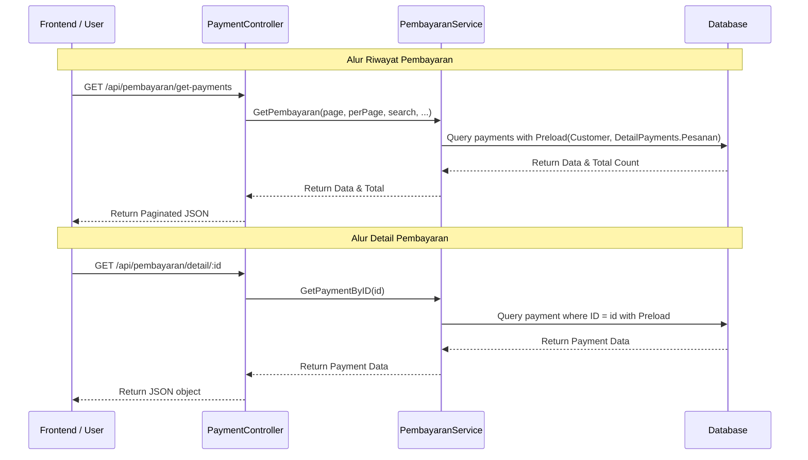

# Dokumentasi API Riwayat dan Detail Pembayaran Customer

Dokumen ini menjelaskan endpoint API yang digunakan untuk mendapatkan daftar riwayat pembayaran dan detail dari suatu pembayaran.

## 1. List Riwayat Pembayaran

Mendapatkan daftar semua pembayaran yang telah dilakukan oleh customer dengan fitur pencarian, filter, dan paginasi.

- **Endpoint**: `GET /api/pembayaran/get-payments`
- **Query Parameters**:
    - `page` (int): Nomor halaman (default: 1)
    - `rowPerPage` (int): Jumlah data per halaman (default: 10)
    - `search` (string): Pencarian berdasarkan nama customer, nomor telepon, atau tipe pembayaran.
    - `dateFrom` (string): Filter tanggal mulai (format: YYYY-MM-DD, default: awal tahun)
    - `dateTo` (string): Filter tanggal akhir (format: YYYY-MM-DD, default: akhir tahun)
    - `tipe` (string): Filter tipe pembayaran (`cash`, `qris`, `tf`)

### Contoh Request
`GET /api/pembayaran/get-payments?page=1&rowPerPage=10&search=Budi`

### Struktur Response (Sukses)
```json
{
    "current_page": 1,
    "data": [
        {
            "id": 1,
            "id_pelanggan": 10,
            "total_pembayaran": 50000.00,
            "nominal_bayar": 50000.00,
            "kembalian": 0.00,
            "tipe": "cash",
            "bukti": null,
            "keterangan": "pembayaran dari Budi",
            "created_at": "2024-03-17T10:00:00Z",
            "customer": {
                "id": 10,
                "nama": "Budi",
                "telpon": "08123456789"
                // ... detail customer lainnya
            },
            "detail_payments": [
                {
                    "id": 1,
                    "id_payment": 1,
                    "id_pesanan": 101,
                    "total_bayar": 50000.00,
                    "kekurangan": 0.00,
                    "pesanan": {
                        "id": 101,
                        "kode_pesan": "ORD-001",
                        "total_harga": 50000.00
                        // ... detail pesanan lainnya
                    }
                }
            ]
        }
    ],
    "total": 1,
    "last_page": 1,
    "per_page": 10,
    "from": 1,
    "next_page_url": null,
    "prev_page_url": null,
    "path": "/api/pembayaran/get-payments",
    "first_page_url": "...",
    "last_page_url": "..."
}
```

---

## 2. Detail Pembayaran

Mendapatkan informasi lengkap mengenai satu transaksi pembayaran berdasarkan ID.

- **Endpoint**: `GET /api/pembayaran/detail/:id`
- **URL Parameters**:
    - `id` (uint64): ID Pembayaran

### Contoh Request
`GET /api/pembayaran/detail/1`

### Struktur Response (Sukses)
```json
{
    "id": 1,
    "id_pelanggan": 10,
    "total_pembayaran": 50000.00,
    "nominal_bayar": 50000.00,
    "kembalian": 0.00,
    "tipe": "cash",
    "bukti": "uploads/bukti/budi_hash.jpg",
    "keterangan": "pembayaran dari Budi",
    "created_at": "2024-03-17T10:00:00Z",
    "customer": {
        "id": 10,
        "nama": "Budi",
        "telpon": "08123456789"
    },
    "detail_payments": [
        {
            "id": 1,
            "id_payment": 1,
            "id_pesanan": 101,
            "total_bayar": 50000.00,
            "kekurangan": 0.00,
            "pesanan": {
                "id": 101,
                "kode_pesan": "ORD-001",
                "total_harga": 50000.00
            }
        }
    ]
}
```

---

## Flow Pembayaran & Riwayat



## Ringkasan Perubahan
1. **Model**: Menambahkan relasi `Pesanan` pada `DetailPayment` agar informasi pesanan muncul dalam riwayat pembayaran.
2. **Service**: Menambahkan fungsi `GetPaymentByID` dan memperbarui `GetPembayaran` untuk memuat (preload) detail pesanan.
3. **Controller**: Menambahkan method `GetPaymentById`.
4. **Routes**: Menambahkan endpoint `/api/pembayaran/detail/:id`.
