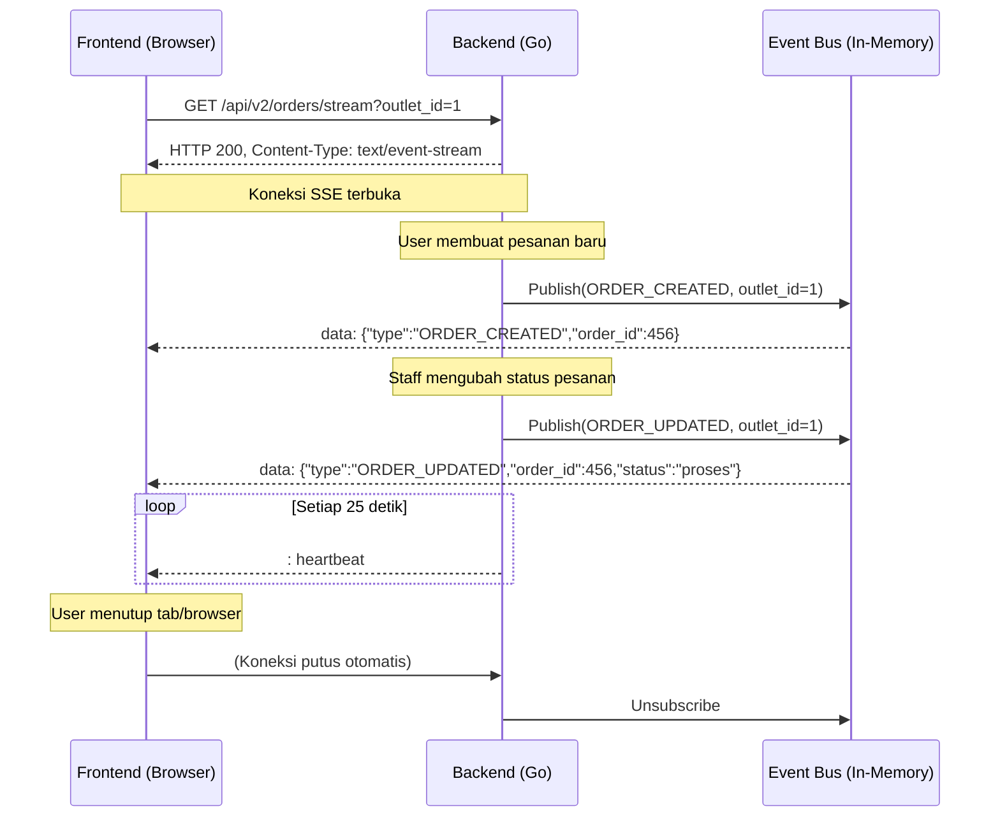

# 📡 API Real-Time Order Stream (SSE)

**Tanggal Dibuat**: 2026-03-31  
**Fitur**: Real-time update data pesanan menggunakan Server-Sent Events (SSE)  
**Tersedia di**: V2 API

---

## 1. Deskripsi

Endpoint ini memungkinkan dashboard frontend untuk menerima notifikasi secara real-time ketika ada **pesanan baru dibuat** atau **status pesanan diubah**, tanpa perlu melakukan polling berulang ke server.

Teknologi yang digunakan adalah **Server-Sent Events (SSE)** — standar web native yang didukung semua browser modern. Koneksi bersifat *one-way* (server → client), sehingga ringan dan tidak memerlukan library khusus.

---

## 2. Endpoint

| Method | Path | Auth |
|---|---|---|
| `GET` | `/api/v2/orders/stream` | Bearer Token (wajib) |

### Query Parameter

| Parameter | Tipe | Wajib | Keterangan |
|---|---|---|---|
| `outlet_id` | `string` | ✅ | ID outlet yang ingin di-subscribe |

### Contoh Request

```
GET /api/v2/orders/stream?outlet_id=550e8400-e29b-41d4-a716-446655440000
Authorization: Bearer <token>
```

---

## 3. Format Event yang Diterima

Server akan mengirim event dalam format SSE standar. Setiap event mempunyai struktur JSON berikut di dalam field `data`:

```
data: {"type":"ORDER_CREATED","outlet_id":"550e8400-e29b-41d4-a716-446655440000","order_id":123,"status":""}
```

### Struktur Payload

| Field | Tipe | Keterangan |
|---|---|---|
| `type` | `string` | Jenis event: `ORDER_CREATED` atau `ORDER_UPDATED` |
| `outlet_id` | `string` | ID outlet sumber event |
| `order_id` | `number` | ID pesanan yang berubah |
| `status` | `string` | Status terbaru pesanan (jika relevan) |

### Jenis Event

| `type` | Kapan Terjadi |
|---|---|
| `ORDER_CREATED` | Ketika pesanan baru berhasil disimpan via `POST /api/pesanan/create-pesanan` |
| `ORDER_UPDATED` | Ketika status pesanan diubah via `PATCH /api/pesanan/update-pesanan/:kode_pesan` |

### Heartbeat

Setiap **25 detik**, server mengirim heartbeat berupa komentar SSE untuk menjaga koneksi tetap hidup (tidak di-drop oleh proxy/firewall):

```
: heartbeat
```

Ini diabaikan secara otomatis oleh browser, tidak perlu ditangani secara khusus.

---

## 4. Alur Kerja



---

## 5. Implementasi di Frontend

### Vanilla JavaScript (Paling Sederhana)

```javascript
// Inisialisasi koneksi SSE
function connectOrderStream(outletId, token) {
  // Catatan: EventSource tidak mendukung custom headers secara native.
  // Gunakan query param token jika backend mendukung, atau gunakan fetch + ReadableStream.
  const url = `/api/v2/orders/stream?outlet_id=${outletId}`;

  const evtSource = new EventSource(url);

  evtSource.onopen = () => {
    console.log('[SSE] Koneksi terbuka untuk outlet:', outletId);
  };

  evtSource.onmessage = (event) => {
    const data = JSON.parse(event.data);
    console.log('[SSE] Event diterima:', data);

    // Trigger refetch daftar pesanan
    if (data.type === 'ORDER_CREATED' || data.type === 'ORDER_UPDATED') {
      refreshOrderList(); // fungsi refetch data Anda
    }
  };

  evtSource.onerror = (err) => {
    console.error('[SSE] Error, browser akan mencoba reconnect...', err);
    // Browser otomatis reconnect, tidak perlu ditangani manual
  };

  return evtSource;
}

// Gunakan
const stream = connectOrderStream('550e8400-e29b-41d4-a716-446655440000');

// Tutup saat komponen di-unmount atau user logout
stream.close();
```

### React (dengan React Query / TanStack Query)

```jsx
import { useEffect } from 'react';
import { useQueryClient } from '@tanstack/react-query';

export function useOrderStream(outletId) {
  const queryClient = useQueryClient();

  useEffect(() => {
    if (!outletId) return;

    const url = `/api/v2/orders/stream?outlet_id=${outletId}`;
    const evtSource = new EventSource(url);

    evtSource.onmessage = (event) => {
      const data = JSON.parse(event.data);

      // Invalidate query daftar pesanan agar otomatis refetch
      queryClient.invalidateQueries({ queryKey: ['pesanan', outletId] });
    };

    evtSource.onerror = (err) => {
      console.error('[SSE] Error:', err);
    };

    // Cleanup saat komponen unmount
    return () => {
      evtSource.close();
      console.log('[SSE] Koneksi ditutup.');
    };
  }, [outletId, queryClient]);
}
```

#### Penggunaan di komponen:

```jsx
function OrderListPage() {
  const { outletId } = useActiveOutlet(); // ambil outlet aktif dari store/context

  // Subscribe real-time update
  useOrderStream(outletId);

  // Query data pesanan seperti biasa
  const { data: orders } = useQuery({
    queryKey: ['pesanan', outletId],
    queryFn: () => fetchOrders(outletId),
  });

  return <OrderTable data={orders} />;
}
```

### Zustand (Jika Pakai Zustand Store)

```javascript
// Di dalam store pesanan atau di komponen utama
import { useEffect } from 'react';
import usePesananStore from '@/stores/pesananStore';

export function useLiveOrders(outletId) {
  const fetchPesanan = usePesananStore((s) => s.fetchPesanan);

  useEffect(() => {
    if (!outletId) return;

    const evtSource = new EventSource(
      `/api/v2/orders/stream?outlet_id=${outletId}`
    );

    evtSource.onmessage = () => {
      fetchPesanan(); // panggil action Zustand untuk refetch
    };

    return () => evtSource.close();
  }, [outletId, fetchPesanan]);
}
```

---

## 6. Catatan Penting

> [!IMPORTANT]
> **Authorization Header & EventSource**: Browser native `EventSource` tidak mendukung custom header (misal: `Authorization: Bearer ...`). Ada beberapa solusi:
> 1. **Cookie-based auth**: Jika backend mendukung cookie JWT, ini cara paling simpel.
> 2. **Query param token**: Backend dapat menerima `?token=<jwt>` — perlu konfigurasi tambahan di middleware.
> 3. **Fetch + ReadableStream** (polyfill via `@microsoft/fetch-event-source`): Library ini mendukung header custom dengan tetap menggunakan pola SSE.

> [!TIP]
> **Strategi Smart Refetch**: Jangan kirim seluruh data pesanan lewat SSE. Cukup kirim *sinyal* (`ORDER_CREATED`/`ORDER_UPDATED`) dan biarkan FE memanggil ulang API GET yang sudah ada. Ini lebih aman, konsisten dengan cache layer (React Query), dan menjaga bandwidth tetap rendah.

> [!NOTE]
> **Auto-Reconnect**: Browser otomatis mencoba menyambung kembali ketika koneksi SSE terputus (default: 3 detik). Backend juga mengirim heartbeat setiap 25 detik untuk mencegah timeout oleh proxy seperti Nginx.

---

## 7. Scope Event yang Dipublish Backend

| Aksi | Route Legacy/V2 | Event Dipublish |
|---|---|---|
| Buat pesanan baru | `POST /api/pesanan/create-pesanan` | `ORDER_CREATED` |
| Update status pesanan | `PATCH /api/pesanan/update-pesanan/:kode_pesan` | `ORDER_UPDATED` |
| Update status via V2 | `POST /api/pesanan/:kode_pesan/status` | *(belum terhubung — perlu ditambahkan jika diperlukan)* |
| Cancel pesanan | `POST /api/pesanan/cancel-pesanan/:kode_pesan` | *(belum terhubung — perlu ditambahkan jika diperlukan)* |
